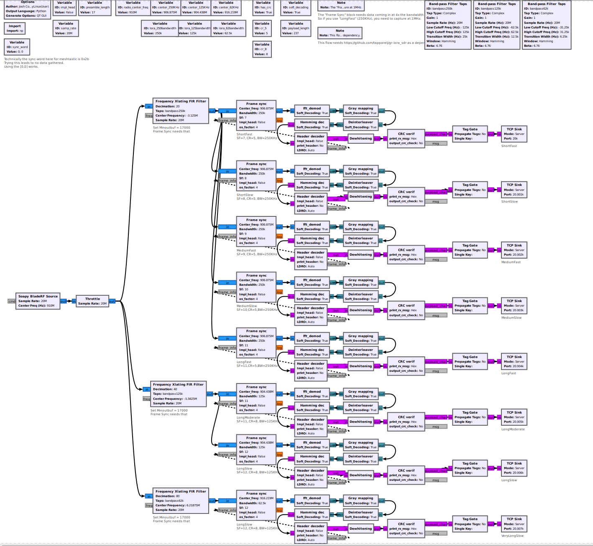
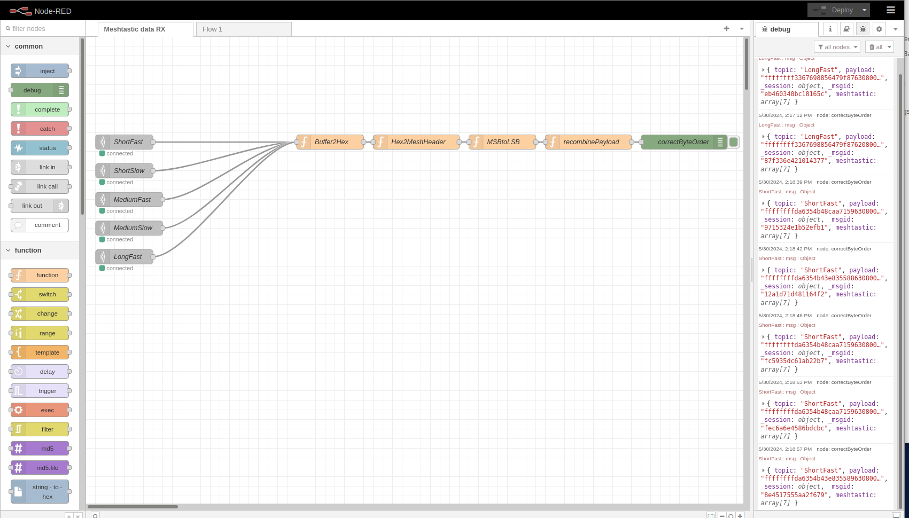

This is a GnuRadio SDR project to fully build a RX and TX stack for Meshtastic.

Now, why would I do this??

An SDR can decode all the presets at the same time. Real hardware can only decode the preset in which its set to.

An SDR, depending on the amount of bandwidth captured, can decode up to all of 900MHz ISM spectrum for all LoRa channels. We only need to throw CPU at the problem.

We can now RX LoRa on non-standard frequencies, like Amateur radio bands with superb propagation. Think 6M or 10M .This also depends on getting the TX flow done. Meshtastic presets do have 250KHz, 125KHz, and 62.5KHz - so this does make LoRa usable for lower bands!

Dependency: https://github.com/tapparelj/gr-lora_sdr

Note: Meshtastic is a trademark by these fine folks! https://meshtastic.org . We wouldn't be doing SDR shenanigans without'em!

1. Download and install https://github.com/tapparelj/gr-lora_sdr
2. To install, clone the repo to your area of choosing. 
3. Inside there is a "gnuradio scrips/RX" directory with 8 files. Some are US and others are EU. 
4. Open the 250KHz respective to your area
5. Change the Source block to the hardware you have. This may be a RTL-SDR, HackRF, USRP, LimeSDR. You might have to install the driver if it's custom hardware.
5. Check for errors. Once good, run the script! You'll see data in console as its being evaluated.
6. To get data OUT of GnuRadio, connect to the respective TCP ports from 20000-20007 for the specific Preset type.
7. You can take this in whatever program you wish, but I provide a very rough Node-Red flow to parse a part of the data.

